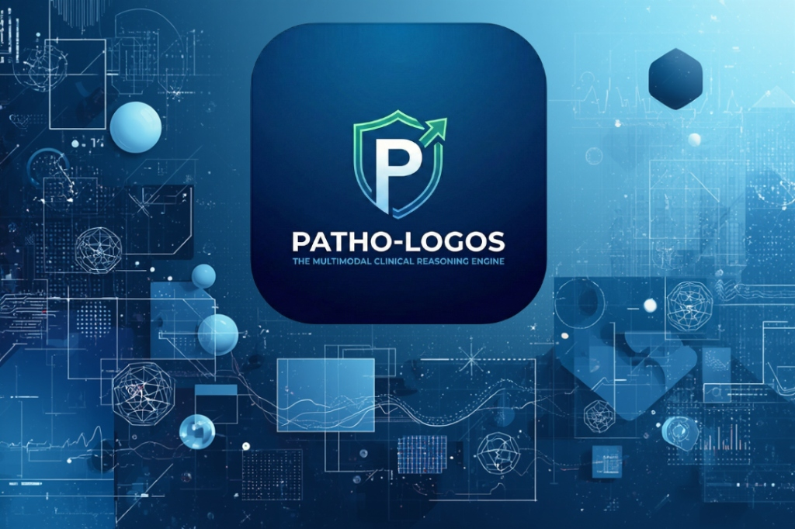

# PATHO-LOGOS: Tier-1 Clinical Reasoning Engine



**Patho-Logos** is an advanced biological reasoning agent designed to solve "Discordant Data" problems in clinical and experimental pathology. Built for the **Google DeepMind Gemini 3 Hackathon**, it synthesizes conflicting multimodal inputs (visuals vs. data) into a unified diagnosis using a novel **"Chain-of-Verification"** workflow.

## 🧬 Mission
To not just classify, but to **synthesize** conflicting evidence.
When a microscopy slide shows benign morphology but RNA-seq data indicates high malignancy, Patho-Logos detects the conflict, generates competing hypotheses, and verifies them to produce a transparent, confidence-scored diagnosis.

## 🚀 Features

*   **Multimodal Input**: Seamlessly ingest Visuals (Microscopy, Western Blots, X-rays) and Clinical Data (Genomic CSVs, Patient History).
*   **Chain-of-Verification**: A strict reasoning loop (Analyze → Hypothesize → Verify) powered by **Gemini 1.5 Flash**.
*   **Conflict Detection**: Explicitly highlights when visual features contradict molecular data.
*   **Structured Output**: Returns precise JSON diagnoses with confidence scores, reasoning traces, and recommended next steps.
*   **Tier-1 UI**: A professional, dark-mode "Clinical Dashboard" designed for clarity in high-stakes environments.

## 🛠️ Tech Stack

*   **Framework**: Flutter (Web, macOS, iOS, Android)
*   **AI Model**: Google Gemini 1.5 Flash
*   **State Management**: Provider
*   **Architecture**: MVVM

## 📦 Installation & Run

### Prerequisites
*   Flutter SDK (3.x+)
*   Gemini API Key

### Getting Started

1.  **Clone the repository**:
    ```bash
    git clone https://github.com/nicolasnorton/patho-logos.git
    cd patho-logos
    ```

2.  **Install dependencies**:
    ```bash
    flutter pub get
    ```

3.  **Run the App**:
    *   **Web**: `flutter run -d chrome`
    *   **macOS**: `flutter run -d macos`
    *   **Android**: `flutter run -d android` (Requires Emulator/Device)

## 🧠 System Role & Logic
See [llms.md](llms.md) for detailed documentation on the System Prompt, JSON Schema, and Reasoning Protocol used by the agent.

## 📄 License
MIT License. Built for the Gemini 3 Hackathon.
